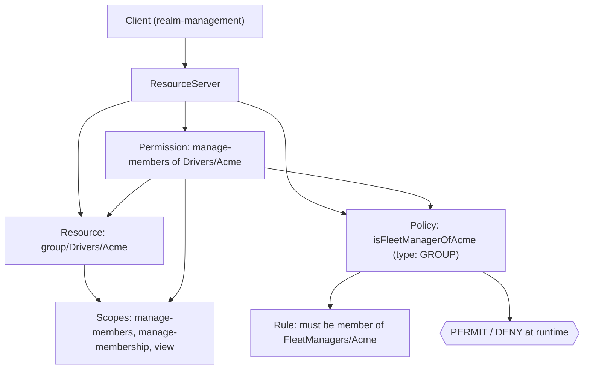
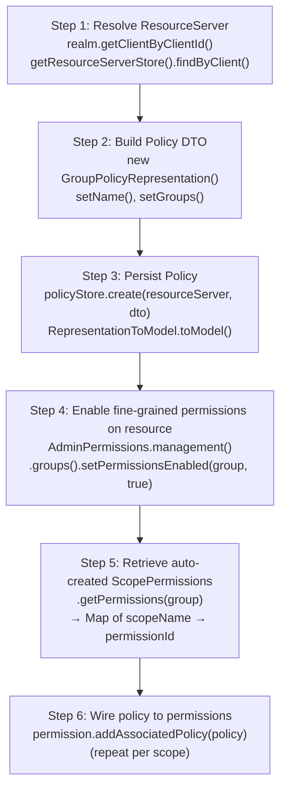
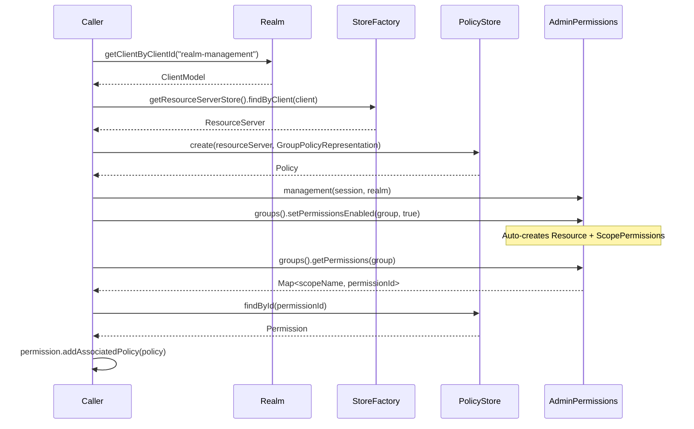

# Keycloak Authorization: Concepts, Classes & Flow

## Core Concepts

Keycloak's authorization is built on **UMA 2.0 / OAuth2**. Five building blocks:

| Concept | What it is |
|---|---|
| **Resource Server** | A client that owns protected resources (e.g., `realm-management`) |
| **Resource** | A thing to protect (e.g., a group, an endpoint) |
| **Scope** | An action on a resource (`view`, `delete`, `manage-members`) |
| **Policy** | A rule that evaluates to PERMIT/DENY (e.g., "user is in group X") |
| **Permission** | Binds Resource + Scope + Policy together — the final access rule |

Policies are **evaluated separately** from permissions. A Permission asks: *"given these policies, can this user do this scope on this resource?"*

---

## Architecture Diagram



---

## Policy Types Keycloak Offers

| Type | Class | Rule |
|---|---|---|
| **Role** | `RolePolicyRepresentation` | user has role X |
| **Group** | `GroupPolicyRepresentation` | user is in group X |
| **User** | `UserPolicyRepresentation` | specific user |
| **Time** | `TimePolicyRepresentation` | within time window |
| **JS** | `JSPolicyRepresentation` | custom JavaScript |
| **Aggregate** | `AggregatePolicyRepresentation` | AND/OR of other policies |

---

## Key Keycloak Classes

```
org.keycloak.authorization
    ├── AuthorizationProvider          ← entry point, get from session
    ├── model.Policy                   ← the domain object
    ├── model.ResourceServer           ← the client's authorization boundary
    └── store
          ├── StoreFactory             ← factory for all stores
          ├── PolicyStore              ← CRUD for policies
          ├── ResourceStore            ← CRUD for resources
          └── ResourceServerStore      ← find ResourceServer by ClientModel

org.keycloak.representations.idm.authorization
    ├── AbstractPolicyRepresentation   ← base DTO
    ├── GroupPolicyRepresentation      ← group policy DTO
    ├── ScopePermissionRepresentation  ← permission DTO
    └── GroupPolicyRepresentation
          └── GroupDefinition          ← group id + path

org.keycloak.models.utils
    ├── RepresentationToModel          ← DTO → persisted model
    └── ModelToRepresentation          ← persisted model → DTO
```

---

## Creation Flow Diagram



---

## Pseudo-Code: Create a Group Policy + Bind to a Permission

```java
// 1. Get the ResourceServer
ClientModel client       = realm.getClientByClientId("realm-management");
StoreFactory storeFactory = session.getProvider(StoreFactory.class);
ResourceServer resourceServer = storeFactory.getResourceServerStore().findByClient(client);

// 2. Build the policy DTO
GroupPolicyRepresentation groupPolicyRep = new GroupPolicyRepresentation();
groupPolicyRep.setName("myPolicyName");
groupPolicyRep.setGroups(Set.of(
    new GroupDefinition(group.getId(), group.getPath(), /*extendChildren=*/ false)
));

// 3. Persist the policy
PolicyStore policyStore = storeFactory.getPolicyStore();
Policy policy = policyStore.create(resourceServer, groupPolicyRep);
RepresentationToModel.toModel(groupPolicyRep, authzProvider, policy);

// 4. Enable fine-grained permissions on a resource (e.g. a group)
//    This auto-creates scoped permissions for that resource
AdminPermissionManagement mgmt = AdminPermissions.management(session, realm);
mgmt.groups().setPermissionsEnabled(targetGroup, true);

// 5. Look up the auto-created permissions by scope name
Map<String, String> permIds = mgmt.groups().getPermissions(targetGroup);
// permIds = { "manage-members" -> "uuid", "view" -> "uuid", ... }

// 6. Associate your policy with each permission
Policy permission = policyStore.findById(realm, resourceServer, permIds.get("manage-members"));
permission.addAssociatedPolicy(policy);
```

---

## Step-by-Step Summary



---

## Gotcha

> `setPermissionsEnabled(group, true)` is **not just a flag** — it is what triggers Keycloak to **create the Resource and ScopePermissions** for that group inside the ResourceServer.
>
> Without calling it first, there is nothing to attach your policy to in step 6.
