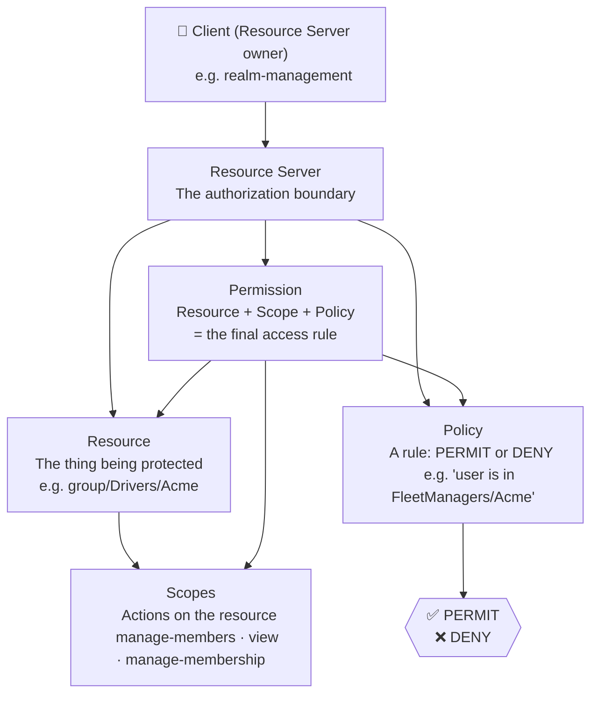
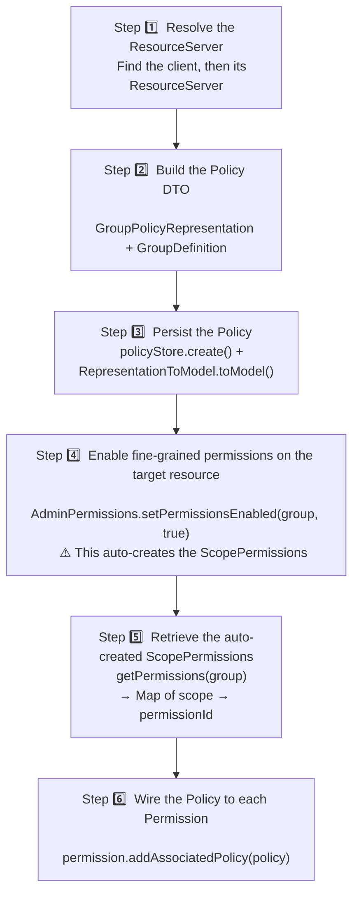
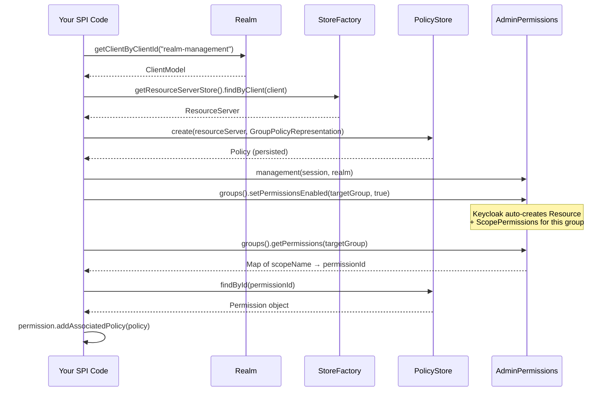

# Fine-Grained Authorization in Keycloak: A Practical Guide to Policies and Permissions

If you've ever needed to control *who can do what* on a specific resource inside Keycloak — not just "is the user logged in?" but "can this specific user manage members of this specific group?" — then you've entered the world of Keycloak's fine-grained authorization services.

In this post, I'll walk you through the core concepts, the Java SPI classes you'll interact with, and a step-by-step code walkthrough to create a Group Policy and bind it to a Permission programmatically.

---

## Why Fine-Grained Authorization?

Keycloak's standard role-based access control (RBAC) is great for coarse-grained checks: "does this user have the `admin` role?". But sometimes you need richer rules:

- *"Only users who belong to the `FleetManagers/Acme` group can manage members of the `Drivers/Acme` group."*
- *"Only users with role X AND during business hours can delete a resource."*

That's where Keycloak's **Authorization Services** shine. They implement [UMA 2.0](https://docs.kantarainitiative.org/uma/wg/oauth-uma-grant-2.0-09.html) (User-Managed Access) on top of OAuth2, giving you a full policy engine inside your realm.

> **Official docs:** [Keycloak Authorization Services Guide](https://www.keycloak.org/docs/latest/authorization_services/)

---

## The Five Building Blocks

Before writing any code, you need to understand the five concepts that Keycloak's authorization model is built on:



| Concept             | Plain English                                                         |
| ------------------- | --------------------------------------------------------------------- |
| **Resource Server** | A Keycloak client that "owns" resources and has authorization enabled |
| **Resource**        | Anything you want to protect: a group, an endpoint, a document        |
| **Scope**           | An allowed action on a resource: `view`, `delete`, `manage-members`   |
| **Policy**          | A rule that evaluates to PERMIT or DENY based on who the user is      |
| **Permission**      | The glue: *"for this resource + scope, apply this policy"*            |

The key insight: **Policies and Permissions are separate**. A Policy just answers "should this user pass?". A Permission decides *where* that answer is applied.

---

## Policy Types

Keycloak ships with several policy types out of the box. Each has a corresponding representation class in the `org.keycloak.representations.idm.authorization` package:

| Type | Class | When to use |
|---|---|---|
| **Role** | `RolePolicyRepresentation` | User must have a specific realm or client role |
| **Group** | `GroupPolicyRepresentation` | User must belong to a specific group |
| **User** | `UserPolicyRepresentation` | Grant access to a specific named user |
| **Time** | `TimePolicyRepresentation` | Access only within a time window |
| **JavaScript** | `JSPolicyRepresentation` | Custom logic via a JS script |
| **Aggregate** | `AggregatePolicyRepresentation` | Combine multiple policies with AND/OR logic |

> **Source:** [`keycloak/keycloak` on GitHub — authorization representations](https://github.com/keycloak/keycloak/tree/main/core/src/main/java/org/keycloak/representations/idm/authorization)

---

## The Java SPI Classes You'll Need

When building a Keycloak SPI extension (e.g., a custom REST endpoint or provider), you interact with authorization through these internal classes:

```
org.keycloak.authorization
    ├── AuthorizationProvider          ← your entry point (get via session.getProvider())
    ├── model.Policy                   ← the live domain object after persistence
    ├── model.ResourceServer           ← the client's authorization boundary
    └── store
          ├── StoreFactory             ← factory to get all stores
          ├── PolicyStore              ← create / find / delete policies
          ├── ResourceStore            ← create / find / delete resources
          └── ResourceServerStore      ← resolve a ResourceServer from a ClientModel

org.keycloak.representations.idm.authorization
    ├── AbstractPolicyRepresentation   ← base DTO for all policy types
    ├── GroupPolicyRepresentation      ← DTO for a group policy
    │     └── GroupDefinition          ← holds groupId + path + extendToChildren flag
    └── ScopePermissionRepresentation  ← DTO for a scope-based permission

org.keycloak.models.utils
    ├── RepresentationToModel          ← converts a DTO into a persisted model object
    └── ModelToRepresentation          ← converts a persisted model back to a DTO

org.keycloak.services.resources.admin.permissions
    ├── AdminPermissions               ← factory for AdminPermissionManagement
    └── AdminPermissionManagement      ← high-level API for enabling/reading permissions on admin resources
```

> **Source:** [`keycloak/keycloak` — authorization package](https://github.com/keycloak/keycloak/tree/main/server-spi-private/src/main/java/org/keycloak/authorization)

---

## Step-by-Step: Creating a Group Policy and Binding It to a Permission

Let's say you want: *"Only members of group `FleetManagers/Acme` can manage members of group `Drivers/Acme`."*

Here's how the flow works:



### And as a sequence diagram:



---

## The Code

```java
// ── Step 1: Resolve the ResourceServer ──────────────────────────────────────
// The ResourceServer is anchored to a Keycloak client.
// "realm-management" is the built-in client that owns admin resources.
ClientModel client = realm.getClientByClientId("realm-management");
StoreFactory storeFactory = session.getProvider(StoreFactory.class);
ResourceServer resourceServer = storeFactory.getResourceServerStore().findByClient(client);

// ── Step 2: Build the Policy DTO ─────────────────────────────────────────────
// GroupPolicyRepresentation declares: "pass if user is in this group"
GroupPolicyRepresentation policyRep = new GroupPolicyRepresentation();
policyRep.setName("isFleetManagerOfAcme");

// GroupDefinition: which group triggers the PERMIT
// Parameters: groupId, groupPath, extendToChildren
GroupPolicyRepresentation.GroupDefinition groupDef =
    new GroupPolicyRepresentation.GroupDefinition(
        fleetManagersAcmeGroup.getId(),
        "/FleetManagers/Acme",
        false  // false = only direct members, not subgroup members
    );
policyRep.setGroups(Set.of(groupDef));

// ── Step 3: Persist the Policy ───────────────────────────────────────────────
// create() allocates the record; toModel() fills in the type-specific fields.
PolicyStore policyStore = storeFactory.getPolicyStore();
Policy policy = policyStore.create(resourceServer, policyRep);

AuthorizationProvider authz = session.getProvider(AuthorizationProvider.class);
RepresentationToModel.toModel(policyRep, authz, policy);

// ── Step 4: Enable fine-grained permissions on the target group ───────────────
// This is NOT just a flag — it triggers Keycloak to create the Resource and
// three ScopePermissions (manage-members, manage-membership, view) for this group.
AdminPermissionManagement mgmt = AdminPermissions.management(session, realm);
mgmt.groups().setPermissionsEnabled(driversAcmeGroup, true);

// ── Step 5: Retrieve the auto-created ScopePermissions ───────────────────────
// Returns a map like: { "manage-members" -> "uuid-abc", "view" -> "uuid-xyz", ... }
Map<String, String> permIds = mgmt.groups().getPermissions(driversAcmeGroup);

// ── Step 6: Wire the policy to the permissions ────────────────────────────────
// Now we bind our policy to each scope permission we care about.
Policy permManageMembers = policyStore.findById(realm, resourceServer, permIds.get("manage-members"));
Policy permManageMembership = policyStore.findById(realm, resourceServer, permIds.get("manage-membership"));
Policy permView = policyStore.findById(realm, resourceServer, permIds.get("view"));

permManageMembers.addAssociatedPolicy(policy);
permManageMembership.addAssociatedPolicy(policy);
permView.addAssociatedPolicy(policy);

// ── Commit ───────────────────────────────────────────────────────────────────
session.getTransactionManager().commit();
```

---

## The Gotcha You Must Know

> ⚠️ **`setPermissionsEnabled(group, true)` is not just a flag.**

It is the call that tells Keycloak to **actually create the Resource and its ScopePermissions** inside the ResourceServer. Without it, there is nothing to attach your policy to in Step 6.

Similarly, when you **delete**, the order matters:

```
1. removeAssociatedPolicy()   ← detach policy from permissions first
2. policyStore.delete()       ← then delete the policy
3. setPermissionsEnabled(false) ← then clean up the auto-created permissions
4. realm.removeGroup()        ← finally remove the group
```

Reversing this order can leave dangling references or throw cryptic errors.

---

## Further Reading

- [Keycloak Authorization Services — Official Guide](https://www.keycloak.org/docs/latest/authorization_services/)
- [Keycloak SPI Development Guide](https://www.keycloak.org/docs/latest/server_development/#_extensions)
- [keycloak/keycloak — GitHub Repository](https://github.com/keycloak/keycloak)
- [UMA 2.0 Specification](https://docs.kantarainitiative.org/uma/wg/oauth-uma-grant-2.0-09.html)
- [`org.keycloak.authorization` package source](https://github.com/keycloak/keycloak/tree/main/server-spi-private/src/main/java/org/keycloak/authorization)
- [`org.keycloak.representations.idm.authorization` package source](https://github.com/keycloak/keycloak/tree/main/core/src/main/java/org/keycloak/representations/idm/authorization)

---

*Written from hands-on experience building a Keycloak SPI extension that manages subcontractor groups and their fine-grained authorization policies programmatically.*
