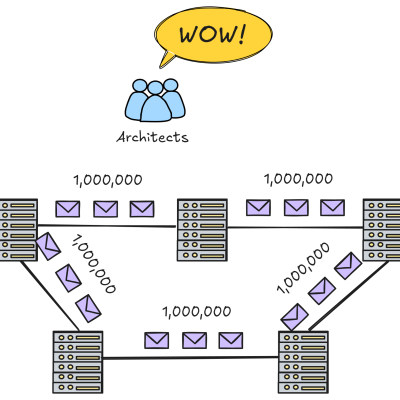
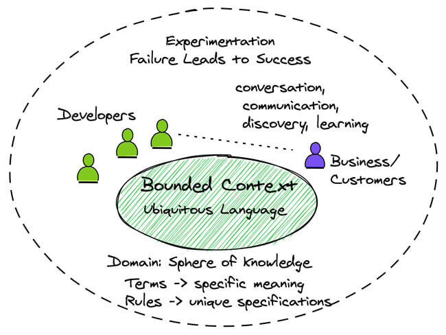
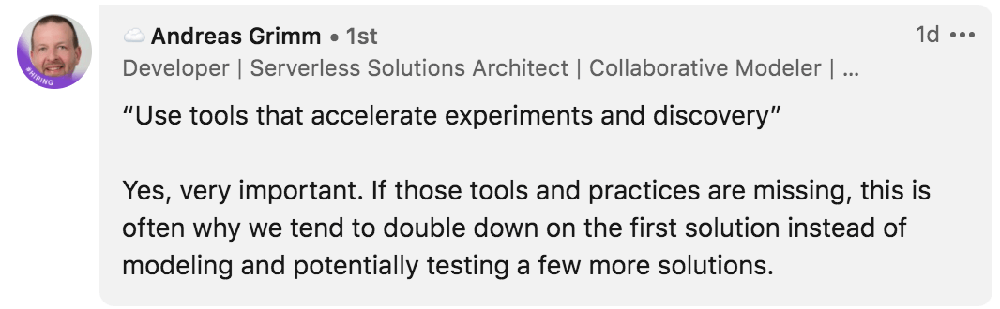

---
tags:
  - ddd
  - architecture
  - microservices
type: article
author: Vaughn Vernon
source: https://kalele.io/architecture-vs-model/
date: 2026-05-05
---

# Architecture vs Model

## Sunto

L'articolo di Vaughn Vernon punta il dito su uno dei problemi più diffusi nel software aziendale: **l'architettura viene promossa e celebrata molto più del domain model**, mentre la maggior parte dei domain model resta ordinaria — così ordinaria che potrebbe essere implementata da studenti universitari a una frazione del costo reale. Nel frattempo, l'architettura di supporto è spesso sovra-ingegnerizzata: "l'architettura può processare 10.000.000+ messaggi al secondo!" — quando il business ne ha bisogno al massimo di 1.000-10.000.

Questo accade perché i pattern architetturali sono **più stimolanti intellettualmente** per i developer rispetto all'esplorazione del dominio. I pattern sono generali, riutilizzabili su quasi ogni progetto, e dopo averli implementati qualche volta perdono il loro fascino — spingendo alla ricerca di meccanismi sempre più nuovi. Il business continua a ricevere troppo poco di ciò di cui ha effettivamente bisogno.

La soluzione proposta da Vernon non è più governance architetturale o management, ma rendere il **domain modeling altrettanto affascinante** attraverso l'innovazione: trattare business expert e developer come motori di innovazione all'interno della loro "sfera di conoscenza". Le innovazioni di dominio, a differenza dei pattern architetturali generali, possono essere uniche, inimitabili, e costituire un vantaggio competitivo reale.

Il metodo concreto è la **discovery-based learning**: due set di domande da porre ripetutamente durante l'esplorazione del dominio. Il primo set sfida le assunzioni di base (*Why? Always? Why not? Are you certain? Immediately?*). Il secondo set esplora i casi limite e ciò che il modello potrebbe ancora non saper fare. L'osservazione degli utenti reali e l'intervista diretta completano il quadro, rivelando workflow mancanti e processi di business che nessuno aveva ancora articolato.

> "While software architecture tends to be general purpose and recurring across many domains, if pursued with breakthrough intent, innovations that drive business competitive advantage can prove to be unique, one of a kind. That is very, very attractive."

Vernon conclude promuovendo strumenti (in particolare la piattaforma XOOM) che permettono di sperimentare e scartare rapidamente modelli inferiori — riducendo il costo di reimplementazione da settimane a minuti — così che la vera scommessa possa essere sull'innovazione del dominio, non sull'architettura.

---

## Le due serie di domande per il domain discovery

### Serie 1 — Sfidare le assunzioni base

| Domanda | Scopo |
|---|---|
| **Why?** | Capire la vera motivazione dietro una regola o un processo |
| **Always?** | Identificare eccezioni che rivelano complessità nascosta |
| **Why not?** | Esplorare alternative scartate senza ragione esplicita |
| **Are you certain?** | Mettere in discussione conoscenze date per scontate |
| **Immediately?** | Capire le reali aspettative temporali del business |

### Serie 2 — Scoprire i casi limite

- *Se pensassimo uno o due passi più avanti, cosa scopriremmo?*
- *Cosa potrebbe andare storto nel modello corrente?*
- *Potrebbe l'utente bloccarsi in un problema da cui è difficile uscire?*
- *Potrebbe il modello aiutare rendendo le soluzioni ovvie?*

> Non "proteggere" preventivamente gli utenti dalle decisioni "sbagliate": una decisione attuale potrebbe essere corretta anche se conflitto con una decisione precedente. Questo segnala quasi sempre un workflow di business non ancora emerso.

---

## Link esterni

- [XOOM Platform docs](https://docs.vlingo.io/) — piattaforma citata da Vernon per rapid domain model experimentation
- [XOOM Source Code](https://github.com/vlingo) — repository GitHub del progetto
- [Add Dot Podcast](https://adddot.io/) — podcast di Kalele (stesso autore)
- Domain-Driven Design LiveLessons (InformIT) — corso video di Vaughn Vernon
- Strategic Monoliths and Microservices (InformIT) — corso video di Vaughn Vernon

---

## Immagini

Le immagini sono salvate localmente in `kalele_architecture-vs-model_images/`.

-  — illustra il gap tra ciò che l'architettura promette (10M+ msg/s) e ciò che il business realmente richiede (1K-10K msg/s)

-  — schema visuale del framework "business experts and developers drive innovation within their domain's sphere of knowledge"

-  — citazione di Andreas Grimm sull'importanza di strumenti che accelerano il domain modeling evitando l'initial-implementation lock-in: *"Use tools that accelerate domain modeling to avoid initial-implementation lock in"*
