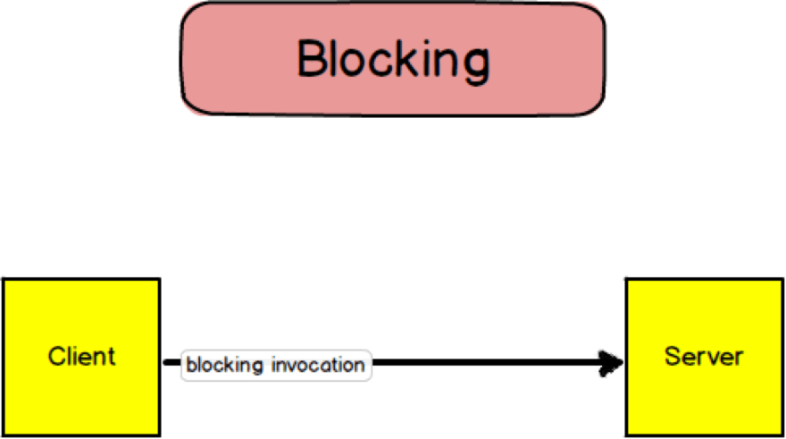
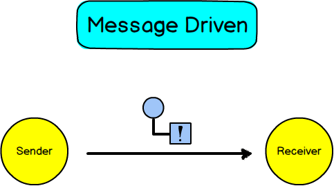

---
tags:
  - architecture
  - java
  - ddd
  - distributed-systems
  - concurrency
  - event-driven
type: article
author: Vaughn Vernon
source: https://kalele.io/vlingo-platform/
date: 2026-05-05
---

# XOOM: Our Open Source Reactive Platform

## Sunto

L'articolo di Vaughn Vernon annuncia e descrive **XOOM** (precedentemente chiamato vlingo), la sua piattaforma open source reattiva costruita attorno a Domain-Driven Design e all'*Actor Model*. Vernon racconta che aveva già questa visione anni prima, ma aveva tentato di contribuirla a progetti con più team e finanziamenti — un rischio che alla fine non ha portato ai risultati sperati. XOOM è la realizzazione diretta di quella visione.

Il cuore della piattaforma è **XOOM/ACTORS**, un'implementazione del *Actor Model* formulato da Dr. Carl Hewitt nel 1973. Alan Kay, inventore della programmazione a oggetti, ha affermato che il modello ad attori cattura meglio di tutto il resto le idee originali degli oggetti. Vernon lo riassume con: "think of objects done right."

La differenza critica rispetto alla programmazione a oggetti tradizionale è il paradigma di comunicazione. Nel modello classico (Java, C#), una chiamata a metodo **blocca** il chiamante fino al ritorno della risposta. Nel modello ad attori, il *sender* invia un messaggio al *receiver* in modo **asincrono**: il messaggio entra nella mailbox del receiver (coda FIFO), e il sender continua la propria elaborazione senza aspettare. L'asincronicità è all-or-nothing: "you don't kind of go swimming."

Ciò che distingue XOOM/ACTORS dalle altre implementazioni dell'Actor Model (Akka/Scala, Erlang, Elixir) è la **type safety**: i messaggi sono fortemente tipizzati tramite interfacce Java, non generici `Object`. Questo rende il modello naturale per i developer Java. Vernon identifica anche perché l'Actor Model fatica nell'adozione mainstream: le implementazioni più mature sono in Scala ed Erlang — linguaggi di nicchia — e la community Java vuole qualcosa il più vicino possibile ai POJO.

Il secondo modulo in arrivo è **XOOM/CLUSTER**, un livello sopra XOOM/ACTORS. La filosofia della piattaforma è l'**estrema semplicità**: download, configurazione pronta per i casi comuni, e produttività entro minuti — non settimane.

---

## I 6 principi di XOOM/ACTORS

| # | Principio | Dettaglio |
|---|---|---|
| 1 | **Attori come unità di computazione** | I comportamenti sono richiesti tramite messaggi asincroni, non invocazioni dirette di metodi |
| 2 | **Gli attori creano altri attori** | "One actor is no actors. Actors come in systems." — Hewitt |
| 3 | **Comportamento per il prossimo messaggio** | Ogni attore designa il comportamento che applicherà al messaggio successivo (State pattern) |
| 4 | **Type safety** | I messaggi sono definiti da interfacce Java. Un attore può implementare interfacce multiple e scegliere quale "faccia" esporre in base allo stato |
| 5 | **Mailbox FIFO** | Ogni attore ha una mailbox; i messaggi vengono processati uno alla volta sul thread disponibile |
| 6 | **Thread = core** | Il numero di thread è calibrato sui core disponibili (`Runtime.getRuntime().availableProcessors()`) |

---

## Blocking vs Async — il contrasto visuale

### Modello blocking (OOP tradizionale)
Un oggetto `Client` invoca un metodo su un oggetto `Server`. È una chiamata **in-process** (stesso JVM). Il `Client` rimane **bloccato** fino al ritorno del `Server`.

### Modello Actor (XOOM/ACTORS)
Il `Sender` actor invia un messaggio al `Receiver` actor. Il messaggio viene recapitato nella mailbox e processato quando un thread è disponibile. Il `Sender` **continua la sua elaborazione** senza aspettare.

> "You don't kind of go swimming. Once you start down the road of asynchronous behaviors, you are all in."

---

## Perché Java e non Scala/Erlang

Vernon identifica le barriere all'adozione dell'Actor Model nel mainstream:

- Le implementazioni più mature (Akka, Erlang, Elixir) vivono in linguaggi non mainstream
- È difficile attrarre contributor su linguaggi di nicchia
- Java, nonostante i suoi limiti, è qui per restare
- La community Java vuole attori "close to POJO" — XOOM/ACTORS lo soddisfa nativamente

---

## Link esterni

- [XOOM Source Code (GitHub)](https://github.com/vlingo) — repository open source della piattaforma
- [XOOM Documentation](https://docs.vlingo.io/) — documentazione ufficiale
- [Add Dot Podcast](https://adddot.io/) — podcast di Vaughn Vernon

---

## Immagini

Le immagini tecniche sono salvate localmente in `kalele_xoom-reactive-platform_images/`.

-  — diagramma che mostra il Client bloccato durante l'invocazione del metodo sul Server (paradigma sincrono/blocking)

-  — diagramma che mostra il Sender che invia un messaggio asincrono al Receiver senza bloccarsi; il messaggio entra nella mailbox del Receiver
