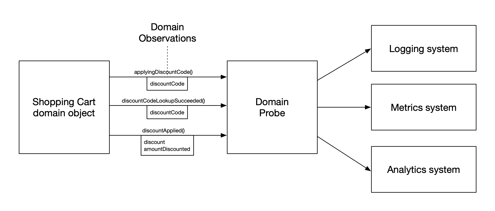
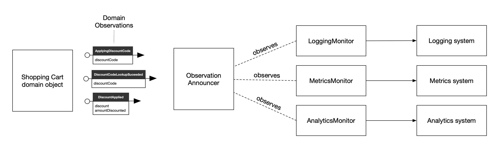

---
tags:
  - observability
  - testing
  - architecture
  - developer-experience
type: article
author: Pete Hodgson
source: https://martinfowler.com/articles/domain-oriented-observability.html
date: 2019-04-09
---

# Domain-Oriented Observability

## Sunto

L'articolo di Pete Hodgson (Thoughtworks) affronta un problema comune ma sottovalutato: il codice di instrumentazione (logging, metrics, analytics) inquina e oscura la business logic nei domain class. In un esempio reale, `applyDiscountCode` è composta per il 75% da chiamate a logger/metrics/analytics e solo per il 25% da logica di business reale.

Il pattern proposto — **Domain Probe** (chiamato anche *Domain-Oriented Observability* o DOO) — estrae l'instrumentazione in classi separate con un'API espressa in linguaggio di dominio. Invece di `this.logger.log("attempting to apply discount code...")`, il domain class chiama `this.instrumentation.applyingDiscountCode(discountCode)`. La classe `ShoppingCartInstrumentation` raccoglie tutta l'instrumentazione tecnica, e il domain class non ha più dipendenze dirette da logger, metrics o analytics.

Il guadagno non è solo estetico. I **benefici sul testing** sono sostanziali: prima del Domain Probe, i test del domain class devono usare spy su logger/analytics con string matching fragile sul formato dei messaggi; dopo, si usa un semplice spy sull'interfaccia del probe con nomi di metodo significativi (`addingProductToCart`, `addedProductToCart`). I test della logica di business diventano indipendenti dai dettagli dell'instrumentazione. Separatamente, la classe di instrumentazione può essere testata in isolamento con test dedicati che verificano esattamente quale messaggio di log o quale evento analytics viene emesso.

Per gestire il **contesto di osservazione** (request ID, user ID, timestamp), l'articolo introduce il pattern `ObservationContext` — una factory che inietta il contesto nel probe, evitando di passare metadata attraverso tutti i livelli del codice.

La sezione finale presenta una **variante event-based**: invece di chiamare direttamente il probe, il domain class emette *Announcement* (eventi tipizzati) tramite un `observationAnnouncer`. Monitor specializzati (`LoggingMonitor`, `MetricsMonitor`) si iscrivono agli annunci e gestiscono l'instrumentazione. Questo disaccoppia ulteriormente il domain dal "cosa fare" con l'osservazione, ma introduce complessità (switch su tipi, molte classi). L'autore suggerisce il Domain Probe diretto come punto di partenza più semplice.

L'articolo chiude con una discussione onesta su **AOP** (Aspect-Oriented Programming): teoricamente attraente per cross-cutting concerns come l'osservabilità, ma in pratica soffre di disallineamento di granularità, annotazioni criptiche nel codice di dominio, magia difficile da debuggare, e testing più complicato. Consiglio: se non si usa già AOP, prudenza.

---

## Evoluzione del pattern in 4 step

### Step 1 — Codice pulito senza instrumentazione

```javascript
class ShoppingCart {
  applyDiscountCode(discountCode){
    let discount;
    try {
      discount = this.discountService.lookupDiscount(discountCode);
    } catch (error) {
      return 0;
    }
    const amountDiscounted = discount.applyToCart(this);
    return amountDiscounted;
  }
}
```

### Step 2 — Instrumentazione diretta (il problema)

La business logic viene sepolta: il 75% del codice è instrumentazione.

```javascript
applyDiscountCode(discountCode){
  this.logger.log(`attempting to apply discount code: ${discountCode}`);

  let discount;
  try {
    discount = this.discountService.lookupDiscount(discountCode);
  } catch (error) {
    this.logger.error('discount lookup failed', error);
    this.metrics.increment('discount-lookup-failure', {code: discountCode});
    return 0;
  }
  this.metrics.increment('discount-lookup-success', {code: discountCode});

  const amountDiscounted = discount.applyToCart(this);

  this.logger.log(`Discount applied, of amount: ${amountDiscounted}`);
  this.analytics.track('Discount Code Applied', {
    code: discount.code,
    discount: discount.amount,
    amountDiscounted: amountDiscounted
  });

  return amountDiscounted;
}
```

### Step 3 — Metodi `_instrument*` estratti (intermedio, ancora nel domain class)

```javascript
class ShoppingCart {
  applyDiscountCode(discountCode){
    this._instrumentApplyingDiscountCode(discountCode);
    let discount;
    try {
      discount = this.discountService.lookupDiscount(discountCode);
    } catch (error) {
      this._instrumentDiscountCodeLookupFailed(discountCode, error);
      return 0;
    }
    this._instrumentDiscountCodeLookupSucceeded(discountCode);
    const amountDiscounted = discount.applyToCart(this);
    this._instrumentDiscountApplied(discount, amountDiscounted);
    return amountDiscounted;
  }

  _instrumentDiscountApplied(discount, amountDiscounted){
    this.logger.log(`Discount applied, of amount: ${amountDiscounted}`);
    this.analytics.track('Discount Code Applied', {
      code: discount.code,
      discount: discount.amount,
      amountDiscounted: amountDiscounted
    });
  }
  // ...altri metodi _instrument*
}
```

### Step 4 — Domain Probe (soluzione finale)

Il domain class chiama solo metodi con nomi di dominio. Non conosce logger, metrics o analytics.

```javascript
// ShoppingCart — usa il probe
class ShoppingCart {
  applyDiscountCode(discountCode){
    this.instrumentation.applyingDiscountCode(discountCode);
    let discount;
    try {
      discount = this.discountService.lookupDiscount(discountCode);
    } catch (error) {
      this.instrumentation.discountCodeLookupFailed(discountCode, error);
      return 0;
    }
    this.instrumentation.discountCodeLookupSucceeded(discountCode);
    const amountDiscounted = discount.applyToCart(this);
    this.instrumentation.discountApplied(discount, amountDiscounted);
    return amountDiscounted;
  }
}

// DiscountInstrumentation — raccoglie tutti i dettagli tecnici
class DiscountInstrumentation {
  constructor({logger, metrics, analytics}){
    this.logger = logger;
    this.metrics = metrics;
    this.analytics = analytics;
  }

  applyingDiscountCode(discountCode){
    this.logger.log(`attempting to apply discount code: ${discountCode}`);
  }

  discountCodeLookupFailed(discountCode, error){
    this.logger.error('discount lookup failed', error);
    this.metrics.increment('discount-lookup-failure', {code: discountCode});
  }

  discountCodeLookupSucceeded(discountCode){
    this.metrics.increment('discount-lookup-success', {code: discountCode});
  }

  discountApplied(discount, amountDiscounted){
    this.logger.log(`Discount applied, of amount: ${amountDiscounted}`);
    this.analytics.track('Discount Code Applied', {
      code: discount.code,
      discount: discount.amount,
      amountDiscounted: amountDiscounted
    });
  }
}
```

---

## Benefici sul testing

### Prima (spy diretto su logger/analytics — fragile)

```javascript
it('logs that a product is being added to the cart', () => {
  const spyLogger = { log: sinon.spy() };
  const shoppingCart = testableShoppingCart({ logger: spyLogger });

  shoppingCart.addToCart('the-product-id');

  // Fragile: dipende dal formato esatto del messaggio di log
  expect(spyLogger.log)
    .calledWith(`adding product 'the-product-id' to cart '${shoppingCart.id}'`);
});
```

### Dopo (spy sul Domain Probe — robusto e semantico)

```javascript
it('instruments adding a product to the cart', () => {
  const spyInstrumentation = createSpyInstrumentation();
  const shoppingCart = testableShoppingCart({ instrumentation: spyInstrumentation });

  shoppingCart.addToCart('the-product-id');

  // Chiaro: verifica il comportamento di dominio, non il formato del log
  expect(spyInstrumentation.addingProductToCart).calledWith({
    productId: 'the-product-id',
    cart: shoppingCart
  });
});

function createSpyInstrumentation(){
  return {
    addingProductToCart: sinon.spy(),
    addedProductToCart: sinon.spy()
  };
}
```

### Test isolati per la classe di instrumentazione

```javascript
describe('ShoppingCartInstrumentation', () => {
  describe('addedProductToCart', () => {
    it('publishes the correct analytics event', () => {
      const spyAnalytics = { track: sinon.spy() };
      const instrumentation = testableInstrumentation({ analytics: spyAnalytics });

      instrumentation.addedProductToCart({
        cart: {},
        product: { sku: 'the-product-sku' }
      });

      expect(spyAnalytics.track).calledWith(
        'Product Added To Cart',
        { sku: 'the-product-sku' }
      );
    });

    it('updates shopping-cart-total gauge', () => {
      const spyMetrics = { gauge: sinon.spy() };
      const instrumentation = testableInstrumentation({ metrics: spyMetrics });

      instrumentation.addedProductToCart({
        cart: { totalPrice: 123.45 },
        product: {}
      });

      expect(spyMetrics.gauge).calledWith('shopping-cart-total', 123.45);
    });
  });
});
```

---

## ObservationContext — gestione del contesto (request ID, user ID…)

Per evitare di passare metadata di contesto attraverso tutti i livelli, si usa una factory:

```javascript
class ObservationContext {
  constructor({requestContext, standardParams}){
    this.requestContext = requestContext;
    this.standardParams = standardParams;
  }

  createShoppingCartInstrumentation(extraParams){
    const paramsFromContext = {
      requestId: this.requestContext.requestId
    };
    const mergedParams = {
      ...this.standardParams,
      ...paramsFromContext,
      ...extraParams
    };
    return new ShoppingCartInstrumentation(mergedParams);
  }
}
```

---

## Event-Based Observability (approccio alternativo)

Invece di chiamare direttamente il probe, il domain class emette **Announcement** (eventi tipizzati). Monitor specializzati si iscrivono e reagiscono.

```javascript
// Domain class — emette eventi, non chiama metodi di instrumentazione
class ShoppingCart {
  constructor({observationAnnouncer, discountService}){
    this.observationAnnouncer = observationAnnouncer;
    this.discountService = discountService;
  }

  applyDiscountCode(discountCode){
    this.observationAnnouncer.announce(new ApplyingDiscountCode(discountCode));

    let discount;
    try {
      discount = this.discountService.lookupDiscount(discountCode);
    } catch (error) {
      this.observationAnnouncer.announce(new DiscountCodeLookupFailed(discountCode, error));
      return 0;
    }
    this.observationAnnouncer.announce(new DiscountCodeLookupSucceeded(discountCode));

    const amountDiscounted = discount.applyToCart(this);
    this.observationAnnouncer.announce(new DiscountApplied(discountCode));

    return amountDiscounted;
  }
}

// Monitor per il logging
class LoggingMonitor {
  constructor({logger}){ this.logger = logger; }

  handleAnnouncement(announcement){
    switch (announcement.constructor) {
      case ApplyingDiscountCode:
        this.logger.log(`attempting to apply discount code: ${announcement.discountCode}`);
        return;
      case DiscountCodeLookupFailed:
        this.logger.error('discount lookup failed', announcement.error);
        return;
      case DiscountApplied:
        this.logger.log(`Discount applied, of amount: ${announcement.amountDiscounted}`);
        return;
    }
  }
}

// Monitor per le metrics
class MetricsMonitor {
  constructor({metrics}){ this.metrics = metrics; }

  handleAnnouncement(announcement){
    switch (announcement.constructor) {
      case DiscountCodeLookupFailed:
        this.metrics.increment('discount-lookup-failure', {code: announcement.discountCode});
        return;
      case DiscountCodeLookupSucceeded:
        this.metrics.increment('discount-lookup-success', {code: announcement.discountCode});
        return;
    }
  }
}
```

### Confronto Domain Probe vs Event-Based

| Aspetto | Domain Probe | Event-Based (Announcements + Monitors) |
|---|---|---|
| **Dipendenze del domain class** | Un oggetto probe (interfaccia di dominio) | Un `observationAnnouncer` generico |
| **Disaccoppiamento** | Alto | Massimo |
| **Complessità** | Bassa | Alta (switch su tipi, molte classi) |
| **Riutilizzo monitor** | No | Sì (stesso monitor per più domain class) |
| **Punto di partenza consigliato** | ✅ Sì | No (se non già architettura event-driven) |

---

## AOP — perché non è la risposta

L'Aspect-Oriented Programming è teoricamente attraente per cross-cutting concerns come l'osservabilità, ma ha limiti pratici:

1. **Disallineamento di granularità**: la DOO non si allinea esattamente con i confini di metodo/classe
2. **Annotazioni criptiche**: il domain code si riempie di annotazioni AOP difficili da leggere
3. **Magia e debuggability**: il comportamento diventa difficile da capire e tracciare
4. **Testing più complesso**: i test perdono la chiarezza che il Domain Probe fornisce

> "If you're not already using AOP, I'd counsel caution here."

---

## Link esterni

- [martinfowler.com — Domain-Oriented Observability](https://martinfowler.com/articles/domain-oriented-observability.html) — articolo originale
- [martinfowler.com — Domain Model](https://martinfowler.com/eaaCatalog/domainModel.html) — pattern di riferimento citato
- [Thoughtworks](https://www.thoughtworks.com) — organizzazione dell'autore Pete Hodgson

---

## Immagini

Le immagini Event-Based sono salvate localmente in `martinfowler_domain-oriented-observability_images/`.

-  — diagramma che mostra il design con Domain Probe diretto: ShoppingCart → DiscountInstrumentation → Logger/Metrics/Analytics

-  — diagramma che mostra il design event-based: ShoppingCart emette Announcements → ObservationAnnouncer → LoggingMonitor / MetricsMonitor → Logger/Metrics
